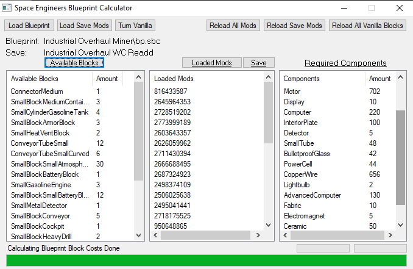
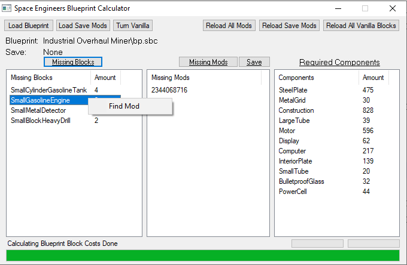
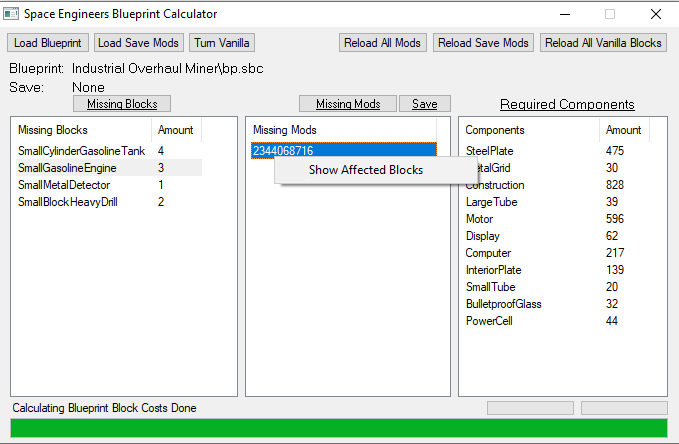

# SE-BlueprintCalculator
Just a Blueprint Calculator

Pick a Save of yours and the Tool will parse all mods that you use for their Block definitions.
Pick a Blueprint and the Tool will parse all its blocks and show the parts it will require to build it, respecting the saves mods and load order. So if you have Overhaul mods like the Industrial Overhaul mod then that mod changes most, if not all, block definitions. The tool respects that.

    

The tool also shows you missing mods and blocks within your Blueprint. Just right click the mod or block and it will send you to the steam pages of the missing mods.

    

    

The tool is made in a way that it parses the games block definitions by itself just as your mods. Hence game or mod updates should not outdate the tools calculations. In case of doubt, just click the "Reload All Vanilla Blocks" and "Reload All Mods" buttons.

The community feedback of this tool was so low and mostly negative that i decided to dump this project.
Dont expect any updates.